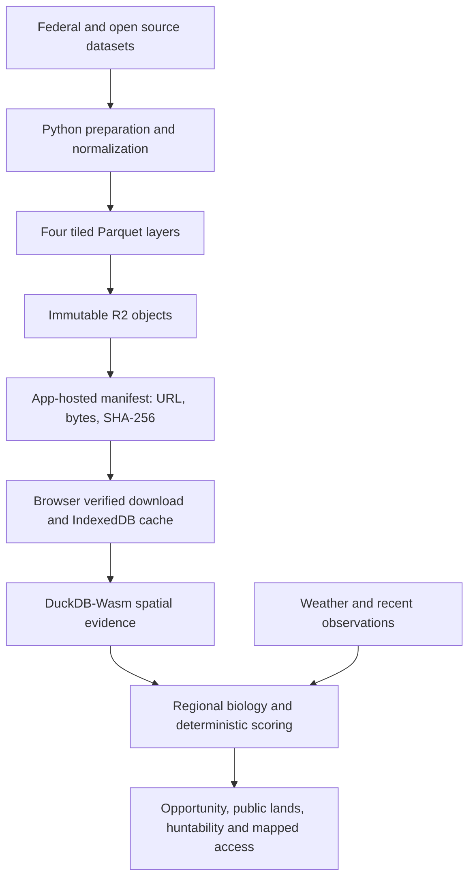

# Architecture

`index.html` is the application. `data/` contains the manifest, research provenance, public-land rules, EPA/state geometry and normalized tile relevance products. App-local URLs are relative, so both root and project-path hosting work. The R2 origin is an independent manifest setting and remains `https://data.hanksjunkdrawer.com/`.

Four layers—habitat, public lands, access points and fire—have immutable, content-addressed names. The manifest declares bytes and SHA-256, and verified-empty evidence is distinct from missing, failed or partial evidence. No Parquet or raw source cache belongs in Git. A new manifest can select different objects; an existing object must not be overwritten.

## National relevance

The pinned `us-land-evidence-cells-v1` definition considers a tile relevant when at least one 0.05-degree habitat sample-cell center lies inside the pinned 2023 1:500,000 Census U.S. state boundary and has Annual NLCD 2023 evidence present and not class 11 (open water). The exact definition, source digests and 922-tile roster are in `data/national-relevance-v2.json`. The normalization replaced cartographic border slivers: 23 legacy tiles excluded and five newly relevant tiles included. Planner and runner share this product. Coverage refers to this finite evidence definition, not every square meter of CONUS.

## Mutable and immutable boundaries

Immutable: published Parquet bytes and their manifest digests. Versioned but changeable through reviewed releases: HTML, profile definitions, calendars, host models, EPA mappings, weights, rules, research, geometry and manifest. Mutable external dependencies: weather, observations, basemap tiles and optional AI/model catalog; CDN library versions are pinned where the app supports it. Changes to one version do not imply a change to the other two.

Biological opportunity remains separate from huntability, collecting permission and physical access. Missing evidence stays missing. The optional OpenRouter analyst interprets immutable model outputs and cannot recalculate them. Local preferences are bounded localStorage values; records and larger caches use IndexedDB. Retain deletion and provenance when changing storage.
